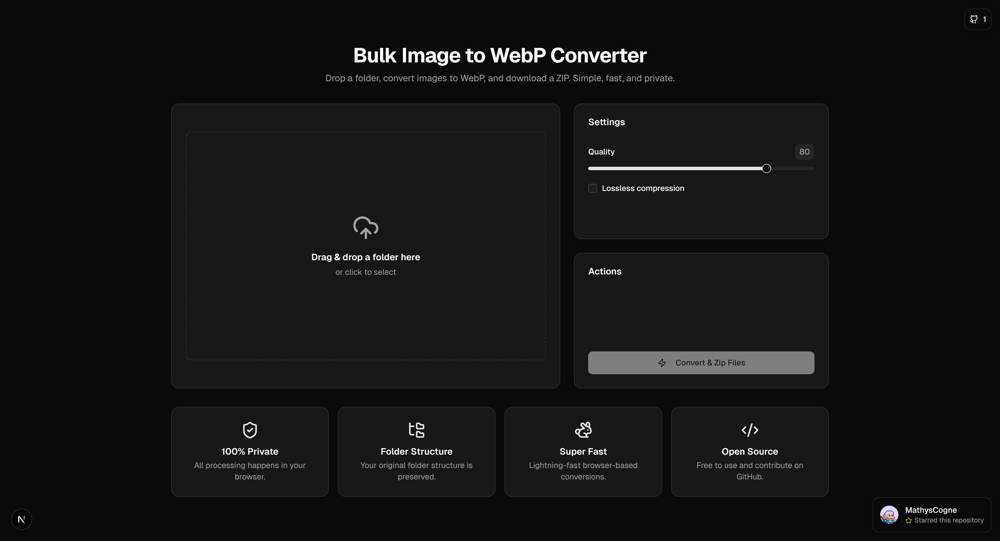

  

    
  

  # Bulk Image to WebP Converter

  **The fastest, simplest way to convert entire folders of images to WebP, right in your browser.**

  No uploads, no privacy concerns, no compromises. Just drag, drop, and download.

 

### The Story Behind This Tool

Tired of slow, ad-ridden websites that force you to convert images one by one? **I was too.**

I needed a simple tool to convert my project assets to WebP without losing the folder structure. Finding nothing that was fast, private, and folder-friendly, I decided to build it myself.

This is the result: a no-nonsense converter that respects your time and your privacy. The best part? You can drop in an entire folder (like your project's `/public` directory), and it comes out perfectly converted and structured, ready to use.

 

 

## ✨ Key Features

-   **📂 Preserve Folder Structure:** Your original folder and subfolder hierarchy is perfectly preserved in the final ZIP archive.
-   **🔒 100% Private & Secure:** All processing is done locally in your browser. Your files are never uploaded to any server.
-   **⚡ Blazing Fast:** Uses modern browser APIs for the fastest possible conversion speeds, even with thousands of images.
-   **🗂️ Bulk Conversion:** Drag and drop an entire folder and let the app handle the rest. Converts PNGs & JPGs to WebP and copies all other files as-is.
-   **🔧 Customizable Output:** Adjust the WebP quality with a simple slider or opt for lossless compression.
-   **❤️ Open Source:** Free to use, and the code is available on GitHub for you to review, fork, or contribute to.

 

---

## ⭐ Contributing

This project is open-source and we welcome contributions! Feel free to open an issue or submit a pull request.

If you find this tool useful, please consider giving it a star!

